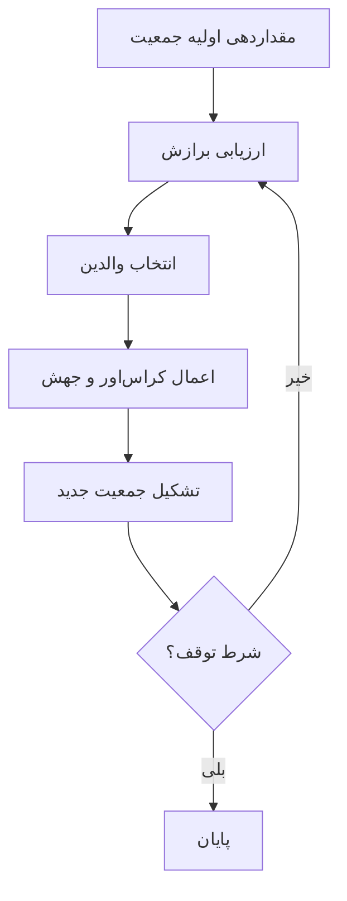

# 📘 خلاصه فصل ۱: مسائل قابل حل در محاسبات تکاملی  
✍ **کتاب:** *Introduction to Evolutionary Computing (2014)*  
📖 **فصل ۱: مسائل قابل حل (Problems to be Solved)**  
👨‍🏫 **نویسندگان:** A.E. Eiben & J.E. Smith  

---

## **۱. مقدمه**  
در محاسبات تکاملی، مسائل به روش‌های مختلفی دسته‌بندی می‌شوند. این فصل چندین نوع مسئله رایج را معرفی می‌کند:  
- **مدل جعبه سیاه (Black Box Model)**  
- **مسائل جستجو (Search Problems)**  
- **بهینه‌سازی در مقابل ارضای قیود (Optimization vs. Constraint Satisfaction)**  
- **مسائل NP و سختی آن‌ها (NP Problems)**  

---

## **۲. مدل جعبه سیاه (Black Box Model)**  
### **تعریف:**  
مدل **جعبه سیاه** از سه مؤلفه تشکیل شده است:  
1. **ورودی (Input):** داده‌هایی که به سیستم داده می‌شود.  
2. **فرایند پردازش (Processing):** نحوه پردازش داده‌ها (نامشخص در جعبه سیاه).  
3. **خروجی (Output):** نتیجه‌ای که از سیستم دریافت می‌شود.  

📌 **اگر یکی از این مؤلفه‌ها نامشخص باشد، مسئله جدیدی ایجاد می‌شود.**  

---

## **۳. بهینه‌سازی در مدل جعبه سیاه**  
🔹 **هدف:** پیدا کردن بهترین ورودی که خروجی بهینه را تولید کند.  
🔹 **مثال‌ها:**  
- **برنامه‌ریزی زمانی دانشگاه‌ها، بیمارستان‌ها و مراکز تماس**  
- **مسئله فروشنده دوره‌گرد (TSP)**  
- **مسئله ۸ وزیر (Eight-Queens Problem)**  

---

## **۴. مدل‌سازی در جعبه سیاه**  
📌 **هدف:** ایجاد مدلی که برای هر ورودی، خروجی صحیحی تولید کند.  
📌 **کاربردها:**  
- **پیش‌بینی بازار بورس**  
- **مدل‌سازی اعتبارسنجی وام‌های بانکی**  
- **سیستم‌های کنترل صوتی و خانه‌های هوشمند**  

---

## **۵. شبیه‌سازی در جعبه سیاه**  
📌 **هدف:** بررسی خروجی‌های مدل تحت شرایط ورودی مختلف.  
📌 **کاربردها:**  
- **اقتصاد تکاملی و شبیه‌سازی جوامع مصنوعی**  
- **پیش‌بینی وضعیت آب‌وهوا**  
- **بررسی تأثیر سیاست‌های مالیاتی جدید**  

---

## **۶. مسائل جستجو (Search Problems)**  
🔹 **در جستجوی بهترین راه‌حل، باید فضای جستجو را بهینه پیمایش کرد.**  
🔹 **مثال:** مسئله فروشنده دوره‌گرد و بررسی تمام مسیرهای ممکن.  

📌 **تفاوت با بهینه‌سازی:**  
- **در بهینه‌سازی، هدف یافتن بهترین راه‌حل است.**  
- **در جستجو، هدف پیدا کردن مسیر مناسب در فضای جستجو است.**  

---

## **۷. بهینه‌سازی در مقابل ارضای قیود**  
🔹 **تابع هدف (Objective Function):** عددی که کیفیت یک راه‌حل را مشخص می‌کند.  
🔹 **قیود (Constraints):** محدودیت‌هایی که باید رعایت شوند.  

📌 **مثال‌ها:**  
- **مسئله ۸ وزیر:** یافتن چیدمانی که وزیرها به یکدیگر حمله نکنند.  
- **مسئله فروشنده دوره‌گرد:** یافتن کوتاه‌ترین مسیر ممکن.  

📌 **نکته:** برخی مسائل قیودی می‌توانند به مسائل بهینه‌سازی تبدیل شوند.  

---

## **۸. مسائل NP و سختی آن‌ها**  
🔹 **کلاس P:** مسائل که **در زمان چندجمله‌ای حل می‌شوند.**  
🔹 **کلاس NP:** مسائل که **در زمان چندجمله‌ای بررسی می‌شوند.**  
🔹 **کلاس NP-کامل (NP-Complete):** سخت‌ترین مسائل NP که **همه مسائل NP به آن‌ها کاهش می‌یابند.**  
🔹 **کلاس NP-سخت (NP-Hard):** حداقل به سختی NP-کامل هستند، اما لزوماً قابل بررسی در زمان چندجمله‌ای نیستند.  

📌 **چالش:** هنوز مشخص نیست که آیا **P = NP یا P ≠ NP** است!  

---

## **📌 جمع‌بندی نهایی**  
✔ **مدل جعبه سیاه:** برای مسائل بهینه‌سازی، مدل‌سازی و شبیه‌سازی.  
✔ **مسائل جستجو:** به دنبال مسیر مناسب در فضای جستجو هستند.  
✔ **بهینه‌سازی vs. قیود:** برخی مسائل قیودی می‌توانند به مسائل بهینه‌سازی تبدیل شوند.  
✔ **مسائل NP:** شامل P، NP، NP-کامل و NP-سخت، که سختی آن‌ها بر اساس زمان حل مشخص می‌شود.  
-----------------
# DeepSeek
---------------

# خلاصه فصل 1: مقدمه‌ای بر محاسبات تکاملی  
**مناسب برای امتحان**  

## 1. محاسبات تکاملی (EC) چیست؟  
- زیرشاخه‌ای از **هوش مصنوعی (AI)** و **بهینه‌سازی**  
- الهام گرفته از **تکامل بیولوژیکی**  
- استفاده از مکانیزم‌های:  
  - انتخاب  
  - جهش  
  - بازترکیب (کراس‌اور)  
  - بقای سازگارترین‌ها  

## 2. اجزای کلیدی الگوریتم‌های تکاملی (EAs)
1. **جمعیت**: مجموعه‌ای از راه‌حل‌های کاندید (فردها)  
2. **تابع برازش**: ارزیابی کیفیت راه‌حل‌ها  
3. **انتخاب**: انتخاب افراد برتر برای تولیدمثل  
4. **عملگرهای تغییر**:  
   - بازترکیب (ترکیب ویژگی‌های والدین)  
   - جهش (ایجاد تغییرات تصادفی)  
5. **جایگزینی**: تشکیل نسل جدید  

## 3. روند کلی الگوریتم تکاملی

## 4. مزایای الگوریتم‌های تکاملی
✅ انعطاف‌پذیر (مسائل مختلف)

✅ مقاوم در محیط‌های نویزی

❌ نیاز به مشتق ندارد

##  5. کاربردها
حوزه	مثال
مهندسی	بهینه‌سازی طراحی هواپیما
زمان‌بندی	برنامه‌ریزی دانشگاه
یادگیری ماشین	تکامل شبکه‌های عصبی
##  6. اصطلاحات کلیدی
فرد: راه‌حل کاندید (کروموزوم)

ژنوتیپ: نمایش داخلی (مثلاً 101010)

فنوتیپ: راه‌حل نهایی

نمونه سوالات امتحانی
چه تفاوتی بین ژنوتیپ و فنوتیپ وجود دارد؟

عملگر جهش چه نقشی در EA ایفا می‌کند؟

یک مثال صنعتی از کاربرد EC بیان کنید.    